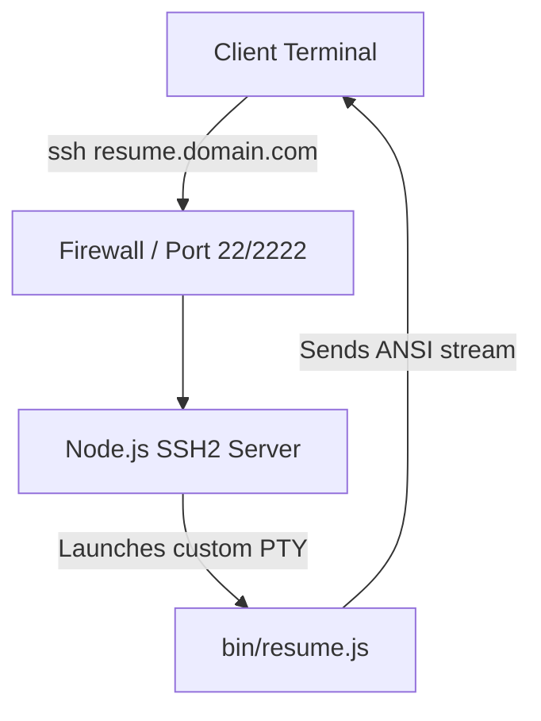

# Implementation Plan: SSH-Accessible 3D ASCII Resume

> **✅ Implemented (2026-08-10).** Approach 1 is live in the repo:
> - `bin/ssh-server.js` — ssh2 server (ESM), passwordless, spawns `bin/resume.js` per connection.
> - `bin/resume.js` — fixed to run under this ESM project and to read input when stdin is a pipe (the SSH case).
> - Host key generated into `keys/` (gitignored). Run locally with `npm run resume:ssh`, then `ssh -p 2222 localhost`.
> - Deployment scaffolding: `Dockerfile.ssh` + `docker-entrypoint.sh` (Approach 1 Docker path) and `deploy/ssh-resume.service` (native systemd, matching this server).
> - **Not yet done:** public exposure (DNS / port-forward / Tailscale Funnel) — pending a decision on domain and exposure method.

This plan outlines how to host your 3D ASCII Resume so that anyone can access it directly from their local terminal using a simple SSH command, for example:
```bash
ssh resume.yuvaraj.dev
```

We recommend using a **Custom Node.js SSH Server** (Approach 1) as it is the most portable, secure, and modern way to implement interactive terminal portfolios (similar to services like `ssh git.charm.sh` or `ssh cmd.to`).

---

## Approach 1: Custom Node.js SSH Server (Recommended)

This method uses the Node.js `ssh2` library to create a lightweight SSH server. The server automatically accepts all incoming connections without passwords, opens a pseudo-terminal (PTY) session, and boots your `resume.js` CLI app.

### Architecture Overview



### Step 1: Install Dependencies
You need the `ssh2` package to handle SSH handshake, cryptography, and terminal channels:
```bash
npm install ssh2 @types/ssh2
```

### Step 2: Write the SSH Server (`bin/ssh-server.js`)
Create a server script that handles key exchanges, terminal window resizing (`sigwinch`), and spawns the resume script in a sub-process:

```javascript
const fs = require('fs');
const path = require('path');
const { spawn } = require('child_process');
const { Server } = require('ssh2');

// Load host private key (needed for SSH encryption identity)
const hostKey = fs.readFileSync(path.join(__dirname, '../keys/ssh_host_rsa_key'));

new Server({ hostKeys: [hostKey] }, (client) => {
  client.on('authentication', (ctx) => {
    // Passwordless authentication: accept any username/password/key
    ctx.accept();
  }).on('ready', () => {
    let channel;
    
    client.on('session', (accept, reject) => {
      const session = accept();
      
      session.once('pty', (accept, reject, info) => {
        // Acknowledge the PTY request from the client terminal
        accept();
      });

      session.once('shell', (accept, reject) => {
        channel = accept();
        
        // Spawn the resume script as a child process
        const resumeProcess = spawn('node', [path.join(__dirname, 'resume.js')], {
          env: { ...process.env, TERM: 'xterm-256color' }
        });

        // Pipe stdin, stdout, and stderr to/from the SSH channel
        channel.pipe(resumeProcess.stdin);
        resumeProcess.stdout.pipe(channel);
        resumeProcess.stderr.pipe(channel);

        // Handle terminal resize events (SIGWINCH)
        session.on('window-change', (accept, reject, info) => {
          if (resumeProcess.stdout.isTTY) {
            resumeProcess.stdout.setWindowSize(info.rows, info.cols);
          }
          if (accept) accept();
        });

        resumeProcess.on('exit', () => {
          channel.close();
          client.end();
        });

        channel.on('close', () => {
          resumeProcess.kill();
        });
      });
    });
  }).on('end', () => {
    // Connection closed
  });
}).listen(2222, '0.0.0.0', () => {
  console.log('SSH server listening on port 2222...');
});
```

### Step 3: Generate Host Keys
Run this script or shell command to generate the server's private RSA identity key:
```bash
mkdir -p keys
ssh-keygen -t rsa -b 2048 -f keys/ssh_host_rsa_key -N ""
```

---

## Approach 2: System-level OpenSSH Configuration

If you prefer using your server's native OpenSSH daemon (`sshd`), you can set up a passwordless login system user account.

1. **Create a limited user account**:
   ```bash
   sudo useradd -m -s /usr/bin/node resume
   ```
2. **Configure the user shell**:
   Change the default shell or execute it on login via `.bash_profile` or `.zprofile`:
   ```bash
   # Add to /home/resume/.bash_profile
   exec node /home/yuvaraj/portfolio/bin/resume.js
   ```
3. **Passwordless configuration**:
   To allow users to log in without a password:
   Edit `/etc/ssh/sshd_config`:
   ```text
   Match User resume
       PasswordAuthentication yes
       PermitEmptyPasswords yes
   ```
   *Note: This approach exposes system-level accounts and is harder to sandbox than Approach 1.*

---

## Deployment & Hosting

To make the SSH server publicly accessible:

### 1. Dockerize the Server (Recommended)
Create a `Dockerfile` to package your node app, host key, and resume scripts:
```dockerfile
FROM node:20-slim

WORKDIR /app
COPY package*.json ./
RUN npm install --production

COPY bin/ ./bin/
COPY keys/ ./keys/

EXPOSE 2222
CMD ["node", "bin/ssh-server.js"]
```

### 2. Deploy to a VPS or Cloud Host
* **Fly.io / Railway / Render**: Deploy your Docker container. Enable port forwarding for TCP port `22` (or custom port like `2222`) straight to the container.
* **VPS (DigitalOcean / AWS / Linode)**: Run the Docker container or Node script using a process manager like `pm2`:
  ```bash
  pm2 start bin/ssh-server.js --name "ssh-resume"
  ```

### 3. DNS Configuration
Set up an `A` record in your DNS provider (e.g., Cloudflare):
* **Type**: `A`
* **Name**: `resume`
* **Value**: Your server's public IP address

If your server listens on port `22`, anyone can type:
```bash
ssh resume.yuvaraj.dev
```
If your server listens on a custom port like `2222`:
```bash
ssh resume.yuvaraj.dev -p 2222
```
